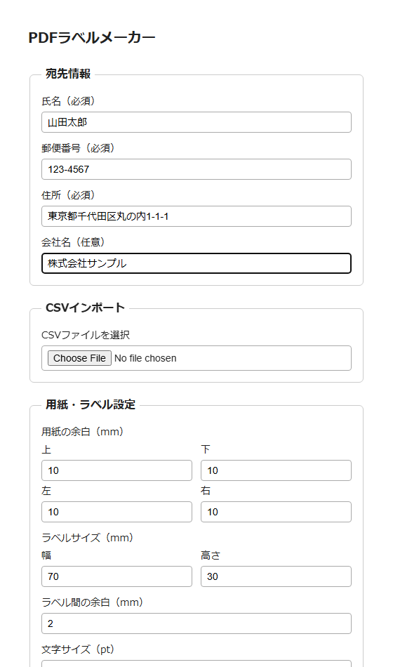

# label-maker

PDFラベルメーカー — 個人利用向けの宛名ラベルPDF生成Webアプリケーション。

氏名・郵便番号・住所・会社名を入力すると、A4のラベル用紙に合わせて配置したPDFをブラウザだけで生成できます。サーバーは使用しません。

## 機能

- 氏名・郵便番号・住所（必須）、会社名（任意）の入力
- CSVインポート（1件分のデータをフォームに読み込み）
- 用紙の余白（上下左右）・ラベルサイズ（幅×高さ）・ラベル間の余白を指定可能
- 上記の設定からA4用紙に配置できる行数・列数を自動計算し、余りはシート中央に配置
- 文字サイズの調整
- [PDFを作成]ボタンでPDFを生成・ダウンロード（同一シート内の全ラベルに同じ内容を印字）

詳しい仕様は [CLAUDE.md](./CLAUDE.md) を参照してください。

## 今すぐ使う

以下のURLをブラウザで開くだけで、ダウンロードやインストールなしにそのまま使えます（GitHub Pagesで公開）。

**https://ynagata6158.github.io/label-maker/**

`docs/index.html` は単一ファイルで完結した動作確認版で、入力からPDF生成までひと通り実際に使えます。ローカルにファイルを持ってきて `docs/index.html` をブラウザで直接開いても同様に動作します。

## 開発状況

- **`docs/index.html`**：動作する単一HTML版。上記の機能はすべて実装・動作確認済みで、GitHub Pagesの公開元としても使用。
- **`src/`**：CLAUDE.mdで定めた技術仕様（React + Vite + TypeScript）に沿った本実装。現在進行中で、`docs/index.html` の内容をReactコンポーネントとして移植する予定。
